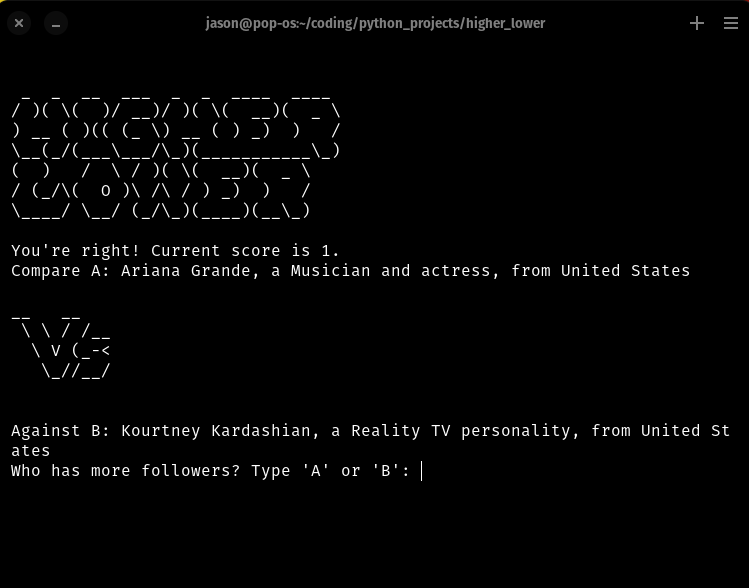

# Higher Lower Game

The Higher Lower game is a fun guessing game where you are given two entities (mostly celebrities or popular brands), and you have to guess which one has a higher follower count on Instagram. Keep guessing right, and you continue to play!

## How to Play
1. Run the `higher_lower.py` script.
2. You'll be presented with two entities.
3. Guess which one has more followers by typing 'A' or 'B'.
4. If you guess right, you proceed to the next round. If wrong, the game ends, and you'll see your score.

## Requirements
- Python 3.x
- ASCII Art for the game is present in the `art.py` file.
- Data for the game is in the `game_data.py` file.

## Contributing
Pull requests are welcome. For major changes, please open an issue first to discuss what you'd like to change.

## Repository Details
[Higher Lower Game Repository](https://github.com/j-breedlove/higher_lower.git)

